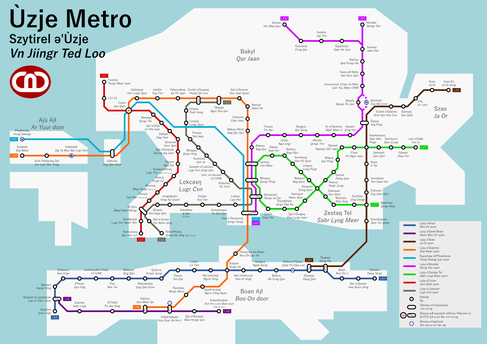

---
title: Ùzje
date: 2016-09-30
...

In the year 1842, a sleepy fishing town in the south of China
was captured by the British over something about drugs.
A hundred and fifty years on,
the town has grown to be the home of seven million inhabitants
and so much money and political clout
that it has become the world's most country-like region
that isn't actually isn't a country.
On the 25th of March, 1990,
the archipelago was declared to be a joint administration zone
where it is simultaneously both part of its colonial parent
and its geographical parent in perpetuity,
an evolution which has been talked about since the late 1970s
after various rebellions.

As a result, Ùzje is an interesting city-state,
product of many thousands of years of Chinese neglect
and several decades of intense British exploitation.
Though it claims to be a place where east meets west,
the claim is largely a PR statement with little in the way to back it up.
For instance, although most official items are bilingual,
including road signs, documents, officials and the Law Establishment House,
the only *real* language that is spoken in these fair isles is Man Gog Yuu,
a Chinese variety that some enterprising fellow not so far in the north
has created as a rebellion to the fading Chinese empire
in the turn of the 20th century.
The region's other language, g'Mòdyfäjq, is imposed by the colonials,
and while it has become the prestige dialect of the region,
it is largely ignored by the public.

Though the British may not have caught the public of Ùzje by their tongue,
they certainly have caught them by their actions:
drivers drive on the left, commuters stand on the right on escalators,
and above all there are massive queues for everything
and a hundred and one unwritten rules about it.
Even some of the flora and fauna of the UK was imported in here
in hopes of making the place homely,
but not many of the imported species
managed to last very long in the sweltering heat,
which in retrospect was not the worst outcome for such an introduction.
It definitely kept the region's biodiversity largely untouched.

The colony was built to be a financial capital from the get go.
Initially it was just to import narcotics to the empire to the north,
but eventually it was a great staging ground to the rest of East Asia,
and the city eventually grew its container and storage ports
until it is largely unparallelled throughout the region.
Eventually banks and factories moved in,
exploiting the region's great interconnectivity.
But despite their almost criminal influence over the local government,
and all their wishes that the currency of the region
can move beyond the archaic systems of pounds, shillings and pence,
Ùzje's pound, the UJP, remains a non-decimal currency,
although the financial sector have attempted to decimalise,
and therefore some currency values are almost exclusively used by them.

For all its faults Ùzje remains an attractive tourist destination,
whether it's just for sightseeing
or if it's for establishment of slightly shady shell companies.
Tourists love the food, the lights, and the excellent wilderness,
whereas the low tax rates and strong connections
make it a great spot for many businesses to set foot.
The only ones that don't really benefit very much from this affair
are the long-standing and long-suffering inhabitants of these very isles,
who have to put up with the whims of three kings
and the demands of half a dozen more cultural expectations
imported from all over the world.
But hey, at least they get pretty good healthcare.

# Essentials #
## Language ##
Ùzje is, according to its Basic Law, a bilingual region.
The two languages are **Man Gog Yuu** and **g'Mòdyfäjq**.
However, the actual bilingualism of the place is somewhat questionable,
as mentioned above.

### Man Gog Yuu ###

> ### Romanisation #
> Cvnr der yanr lvvr ja,
> cun imr tor kunr lig nir cii yaar tor pingr dang der cvt sang yer.
> Ta ja lee sing tor jji jjing yon gv yer,
> ir ing yur gaa der ne yon dv door yer.
>
> <aside>
> The dots, semicolons and commas
> are supposed to be in the same square as the character preceding them,
> but due to technical limitations this is not possible.
> </aside>
>
> ### Pure Hangul #
> 즌，데，얀，르；차、
> 준임，토，릭당니，지．야，토，핑，당데，즏상예，。
> 타차레．싱토，찌찡욘그예，、
> 이，잉유，가．데，네욘드도；예。
>
> ### Hangul mixed script #
> 全데，人類차、
> 尊嚴토，權力니，自由토，平等데，出生예，。
> 他차理性토，自正욘具예，、
> 이，잉유，家데，儞욘對待예。

Invented by enterprising idealist Jjan Yuu Manr some time in the late 1890s
and published on 1901-05-06 in Canton,
Man Gog Yuu is an auxiliary language that attempts to be the common language
of all of East Asia,
although it was originally built to be a language
for use of the anti-imperial rebellion.
Unlike certain similar movements in Europe,
this one grew to be surprisingly successful,
but the reach is still not as far as the creator would have hoped;
it has become the administrative language of the South China region for sure,
as well as strongholds in northern Vietnam and some parts of Taiwan and Ryukyu,
but it spread was hampered in Korea and Japan
and it's actively being suppressed in the North.

As one can expect it is largely a few lexemes drawn from Japanese, Korean,
a smattering of Chinese dialects and a smidgen of Vietnamese
embedded in a largely Classical Chinese matrix.
There are a handful of particles that act as case endings
that are imported from Japanese,
and the script is Hangul, the script invented in Korea,
but Vietnamese involvement is minimal short of a few token lexemes
and the fact that the Romanisation is bafflingly
one syllable per space-separated word.

As with its source languages, the script is written in square blocks,
with options to write horizontally and vertically.
The script is [Korean mixed script][],
where Chinese characters are employed to write lexemes – content words –
and grammatical particles and conjunctions are written in Hangul.
There is quite a lot of variation and leeway
as to which word is written as which script,
but it was advised in the source book
that Chinese characters are to be used as far as possible
to increase interoperability across the region.

The Latin script is also adopted as an official script,
which was intended to replace the characters after Westernisation
but such a thing never happened
and now the Latin script is merely a conventional way to translate names
into langauges using Latin-based scripts.
Yuu Manr has ignored some of the subtleties of the Latin characters
in favour of convenience in transliteration,
as a manner of attempting to establish an East Asian identity
separate from the West while still enabling exchange with them.

[Korean mixed script]: https://en.wikipedia.org/wiki/Korean_mixed_script

### g'Mòdyfäjq ###

> ### Traditional orthography ###
> Ołjünytb bərþt yð'vredəq ən yð'sennesz yð'selfwəþ ən yð'dun.
> Qib g'əqdawt ð'risəq ən ð'rajtþyŋk so qib cg'opryt y'spiryt ə'braðəlajk səd.
>
> ### Reformed orthography ###
> Ołjünitb berþt yð'vrédeq en ið'sennesz yð'sélfweþ en yð'dun.
> Qíb g'eqdawt ð'ríseq en ð'rajtþiŋk so qíb cg'oprit y'spírit e'braðelajk sed.
>
> ### Cyrillic orthography ###
> Ољйӱнытб бәрѳт ыҙ'вредәӄ ән ыҙ'шеннес ыҙ'шелфўәѳ ән ыҙ'дун.
> Ӄиб г'әыдаўт ҙ'ришәӄ ән ҙ'райтѳуңк шо ӄиб чг'опрыт ы'шпирыт ә'браҙәлайк шәд.

A particularly unusual drawl in some unspecified location in the British Isles
have brought forth this highly aberrant language,
which while clearly descended from English has been altered so extensively
that there are no doubts that it is a completely separate language.
There are some speculations that the radical and at times implausible changes
are a product of conscious change rather than unconscious wandering,
but such claims have never been supported with evidence,
short of a few sporadic word derivation systems here and there.

The language has a special relationship with English,
which exists elsewhere in the remnants of the British Empire.
There is a one-way system for translating English words into g'Mòdyfäjq,
which is called c'preq.
The "translation"'s goal is not to import the word into g'Mòdyfäjq,
but to make an alternate version of the word
that has features and qualities unique to g'Mòdyfäjq.
This system grew out of an in-joke of sorts
that has spread to become part of the standard language
and there is sufficient evidence in the way of written records
to confirm that this feature at least
is a deliberate and conscious addition to the language.
The alternate orthography, which is in Cyrillic,
provides further obfuscation and is another invention.

g'Mòdyfäjq has been selected as the colonial language of the region
rather than English proper because Ùzje has never really been a normal colony.
First of all, there are several interesting characters
that were appointed as governors of the region –
specifically, those who are privy to the business regarding g'Mòdyfäjq
and are sympathetic to it for various reasons,
not least of which is that one of them is a spearhead of the language itself.
Another key fact is that Ùzje has always been somewhat rebellious
and wishes to be independent in some way or another,
and granting them a separate language
is a very easy way to placate the colonials that have found their way there.
Finally the fact that Ùzje is such an established based for g'Mòdyfäjq speakers
have ensured that the place will become attractive for more g'Mòdyfäjq speakers,
making a feedback loop that all ends up with it being the official language
over English.

However g'Mòdyfäjq has never been that popular outside of the aristocratic elite
and therefore in the street
apart from a few compulsory lessons and some rare cases
the language is largely unspoken.
There had been grumbles that English should be adopted over all,
but those proposals have never made it into the polls, for whatever reason.
There are also government-subsidised courses
that teach translating English to g'Mòdyfäjq but those rarely get attendence.

g'Mòdyfäjq has shown itself elsewhere the remainders of the Empire as well,
with established speaking communities in Australia and New Zealand,
as well as isolated pockets in New Columbia.
Its usage outside of Anglosphere-dominated areas is virtually unheard-of,
though a few significant exceptions exist in the Netherlands
and parts of ex-Colonial Africa.

### Other languages ###
The source languages of g'Mòdyfäjq and Man Gog Yuu,
which are English, and the varieties of Chinese and Japanese repsectively,
still do have some presence in Ùzje
but are significantly muted in favour of the two official languages.
However place names in g'Mòdyfäjq
are derived mostly from the corresponding Cantonese place names,
rather than through their Man Gog Yuu pronunciations.
This sometimes results in places where the g'Mòdyfäjq name
can sometimes distinguish names while the Man Gog Yuu name cannot.

Apart from those, a smattering of other languages have significant minorities.
On the Asian side we have immigrants (and/or invaders) from Japan and Korea
that have came in through their Man Gog Yuu speaking credentials
but have also brought their native languages along;
the local market for domestic helpers have brought Indonesian and Tagalog,
as well as the various languages in India;
and there's also a handful of Vietnamese speakers,
enough for them to form a newspaper.
On the European front, there's German, Dutch, French and Spanish,
in decreasing order of speaking population.
Most of these speakers, Asian and European,
also speak one of the two official languages,
due to the government heavily promoting them.

## Currency and Pricing ##
The Ùzje Pound (£ or U£) is a non-decimal currency.
It is based on the British currency of the same name,
and is also divided the same way –
twelve pence make a shilling, twenty of which make a pound.
The penny is also divided into four farthings,
but in general only halfpennies are used.

<aside>
    SI multiples can also appear next to pounds,
    but only the multiplicative (> 1) ones and only informally.
    SI multiples may never be used on shillings.
</aside>

In response to decimalisation, one thousand pennies also make a kilopenny (kd).
One kilopenny is equal to four pounds, three shillings and fourpence.
Although heavily used in the financial sector,
the kilopenny has never found much use outside of it
apart from some commemorative currency and as a price point.
Further SI multiples may be used, resulting in Md, Gd, Td, and so on.
Diminutive multiples are rare, except for the millipenny (md),
which is the trading currency used in the Ùzje stock market.

The standard method of writing a currency in pounds-shillings-pence
is to write separate the three units with slashes or short horizontal lines,
and sandwich the entire expression in (U)£…(d),
so for instance the kilopenny is written as £4/3/4d or U£4–3–4.
However, there is significant variation in practise,
and the format is also written £4 3s 4d, £4+3/4 or even 83′ 4″.

The kilopenny family of values have a slightly different way of notation.
A number, which is either an integer
or a decimal with a multiple of three decimal places
is then followed by a space then the unit.
One pound, which is equal to 240 d, is then either written as such,
or as 0.240 kd, 0.000 240 Md, and so on and so forth.
Note that 250 md is a farthing, but 250 Md is one billion farthings,
which is equal to U£1 041 666/13/4,
so while case distinction is significant
there is *usually* enough context to distinguish the two.

Table: Typical food prices

Item                                   £    s    d   f
----------------------------------- ---- ---- ---- ---
Breakfast (simple)                          2    6
Breakfast (high-class)                      7    9
Lunch (simple)                              5
Lunch (high-class)                         12
Dinner (simple)                             6    6
Dinner (high-class)                        15
Dinner (family gathering, per head)    1    5
Drink                                            7   2
Fast food                                   2    3

Food is usually pretty affordable and reasonable here,
as long as one either sticks to fast food and local cuisine.
These are typically found in less touristy places (of course)
and are family-run.
The taste is generally agreeable to all,
though for the more adventurous eaters there are exotic meals available
near Zestəq Tel.

Table: Typical transport prices

Item                                   £    s    d   f
----------------------------------- ---- ---- ---- ---
Bus (2 km)                                       3   2
Bus (10 km)                                      6   2
Bus (cross-border)                          3   10
Metro (minimum)                                  4   2
Metro (across Boan Ajł)                         10
metro (maximum non-cross-border)            2
Metro (cross-border)                        3    8
Tram                                             2   2
Bike hire per hour                               6
Taxi flag-fall                              1
Taxi per 200 m                                   1   2
Taxi per 30 seconds                                  2

Transport is inexpensive and plentiful.
The relatively small area of Ùzje combined with (mostly) agreeable terrain
makes it very easy for a public transport system to flourish and grow.
That having been said, the roads are plenty wide,
and apart from the perpetual and inevitable problem of finding car space
and the noticeably expensive petrol tax
private cars are largely pleasurable to use in the territory.
However, cyclists beware, as bike hiring is exorbitant
and it might be better to buy or bring your own bike.

Table: Typical housing and accommodation prices

Item                                 Md    £    s    d   f
----------------------------------- --- ---- ---- ---- ---
Capsule hotel per hour                          2    7   2
Capsule hotel per day                      1    1    8
3-star hotel per night                     5   10
5-star hotel per night                     9   10
6-star hotel per night                    12   15
Flat (10 m²) rent per month               43    6    8
Flat (50 m²) rent per month               60
Flat (100 m²) rent per month              90
House (100 m²) rent per month            500
Flat (10 m²) sale price                 6000
Flat (50 m²) sale price               3 2500
Flat (100 m²) sale price             15 1250
House (100 m²) sale price           120

If you're living here, the rent would be completely unreasonable,
but if it's just for a stay in the hotels then Ùzje lets up a little.
As with most Asian countries, the lack of land suitable for city-building
has led to many compact designs, including the budget "capsule hotel",
which is little more than a 275 × 150 cm bed and an enclosure.

Although prices are here given in pounds,
it is a custom of the real estates agency to print prices in megapence
with pounds being secondary. 1 Md = £4166/13/4, but usually to make things easier
prices are in multiples of 3 Md = £12500 exactly.

# Getting in #
## By air ##
By far the most popular way to get into Ùzje
is through the gargantuan Þrulaqt-Pleqhevəq ə'Ùzje – Ùzje International Airport.
The five-runway, three-terminal airport is placed on the edge of the territory,
directly next to the western end of the M4
and accessed via the A550 to A555 roads.
It handles aeroplane movement (takeoff or landing)
once every twenty to thirty seconds,
resulting in a yearly throughput of about 700,000 flights, or 24 MU.

Navigation throughout the airport is relatively simple if somewhat tiring
due to its massive size.
The signs are usually adequate, although there are a few trouble spots
where a sign might be ambiguous or absent.
The roads around the airport are a bit of a maze
and require close attention to signage or a good GPS.
The parking is a little bit inadequate for airports of its size,
and there isn't much of a car rental service either.

For such a large airport the landside (before security) area
is curiously undersized, especially for the oldest terminal;
this is because the government was expecting that tourists
would go to nearby Szajmej to do their last- (or first-) minute shopping,
confident that the prices in an urban and residential area
would be much closer to the prices in the airport area
and therefore spending more.
The two places are literally on either side of the M4,
and a dedicated shuttle service and driverless train service
moves tourists between them.

Security is largely painless,
or at least as painless as the international authroities can allow;
immigration for locals are convenient and electronic
but for those who *really* don't want
to hand over their fingerprints to the government
a manual service is available.
Past security there is a much more sizeable collection of shops –
going back to Szajmej is no longer an option –
and a couple of automated trains
connecting the airside areas of the terminals together.

## By land and sea ##
The M1 and M8 connect Ùzje to China, and the M4 connects it to Damdsaj.
These are the only land routes to Ùzje,
but they are very robust and can withstand the strongest of storms.
All three are guarded by checkpoints,
because Ùzje runs its own customs and immigration service.
There's no major crossover problem –
both China and Damdsaj drive on the left,
and have the steering wheel on the right.

Queues might be another problem though –
on average more than a hundred thousand vehicles pass through the border
and most of them all have to go under customs and immigration checks.
This results in massive queues in the busiest hours
and a giant waiting park on both sides of the bridges.

If you don't drive, or have hazardous materials that are unsuitable for bridges,
then you must enter via the ferries.
There are ferries coming in the same places where the bridges go to –
north to China, and west to Damdsaj.
However, truckers commanding hazardous chemicals
will have to ride car ferries from the north,
docking in Moŋdej in and rejoining the main car traffic on the M3.

# Getting around #
The size of Ùzje makes it an excellent place to build public transport,
and it has one of the world's most affordable and extensive schemes in the world.
Here's a whirlwind tour of its network.

## The Ùzje Metro ##

Locally known as the UJTL or the S/Ù,
the Ùzje Metro was proposed shortly after the riots
to appeal to the concerns of the increasingly unsatisfied populace.
Though at first it was derided as a white elephant,
it has soon proved itself to be the crown jewel of the transport network.
With nine lines spanning over a hundred stations,
the network serves all city centres of the territory
and a handful of other places too.

The metro was built in stages,
starting from a section of the LZT and the LCJ.
The overall plan has, while adapted to the changing realities of development,
never strayed far from the original vision:
two lines that circulate around the Lokcəxn Peninsula,
a line up to the north, a line up to the east, a line up to the west,
a line across the south, and a line to connect them all up to the airport.

The metro system is nothing short of delightful
compared to the rest of the world.
All stations and trains are air-conditioned
(which is a near-essential in this sweltering city),
and the trains run as often as once per 40 seconds at rush hour.
Cost is extremely reasonable at an average distance cost of 350 µd/m (2.9 km/d).

As it currently stands the metro is incomplete;
a lot of stations are under planning
and many plots of land are left empty for future development.
There's no guarantee that the development will ever come;
recently the construction has drawn the ire of many locals
who think the economic benefit of the metro coming to them
is not enough to balance the losses that come with it.
However, for the tourist,
the metro provides a great whirlwind tour of the territory.

## Boan Tramways ##
<!-- Map of the network here. -->
With over 330 stops all across the north shore of Boan Isle, the Boan Tramway
provides an irresistibly cheap and convenient transport option for all those who
live near it. Regular customers love it for its convenient station density and
unbeatable prices; tourists love it for its slow, down-to-Earth alternative to
the fast-paced city that it serves.

Founded in 1904, the network was built in stages starting from Grot-Arzeqt.
All of it is double-tracked, with one set of tracks in each direction,
with some particularly busy sections getting another set of tracks.
Usually the extra set of tracks are placed on the edge of the road
where the original set of tracks are at the centre.

The trams are all very old, over forty years old in some cases,
and they are all double-deck and seat about 120.
While they have a top speed of about 60 km/h,
going anything over 40 km/h in one of the tramcars
is a truly hair-raising experience for the riders.

Most tram cars are non-air-conditioned,
making them fairly unpopular in the summer months.
Air-conditioned trams are slightly more expensive than non-air-conditioned ones,
but in either case the prices are nearly impossibly low:
3d is the most that one journey can charge you,
and there are concession fares for everyone and everything.
(No monthly or annual passes though, that's not a thing yet).
It is primarily propped up by the elderly and the prodigious amount of tourists,
with some help by the public sector to preserve the system as it is.

Tram tracks run on the road for the most part,
giving the passengers a close-up view of life on the streets of Boan Ajł.
However, some parts of the network *do* run on their own right-of-way,
for instance in ð'Crantanel, which is as its name suggests a tram tunnel.

## The Light Rail ##
<!-- Map of the light rail here. -->
Meanwhile on the other side of ð'Qabar,
a newer, fully air-conditioned and even more sprawling Light Rail Network
sprawls across Zestəq Tel.
These are like trams in function but very different in form:
they are modern, single-deck, double-car articulated trains
with some element of premetro systems
as a significant amount of its track is under dedicated right of way –
and surface level.

The network is far less linear than the tram,
it not being hindered significantly in one particular direction or another,
and it's notably less of a legacy system as well, as mentioned earlier.
As a result the system is much more expensive
and lacks much of the flair that the tram system has.

There are other light rail systems in the Bakył and the Hundred,
but they are comparatively less well-developed and more linear.
In particular they tend to run more like minibuses than actual trams.

## Busses ##
Host to the largest bus fandom in the world (!),
the Ùzje bus system is not only extremely dense and frequent
but also is entirely (to a rounding error) comprised of double-decker busses.
Though slower than the rail-based alternatives,
travel on the bus is greatly affordable
to the point where prices are given in multiples of 50 millipence –
the bus companies having lobbied the government to allow their prices
to have a resolution below the legal tender quantum of ½d (500 md).
Typically, prices per metre is between that of the tram and the metro,
with the shortest bus routes only costing 2.45 d (but written as 2·45″)
and the longest ones just over 3/6 (3′ 6·00″ on the fare table).
More typical busses usually take a sixpence though;
a typical fare might be 5·60″.

This special pricing arrangement comes with it a stored-value card
that was once the domain of the metro
but has since grown to be a cash replacement for smaller denominations,
which is defined to be less than 1.024 kd (£4–5–4, 85′ 4·00″),
though to make things easier for the average user
the cap is advertised to be £4 (80′ 0·00″) exactly.
The stored-value card has otherwise been used in multiple other contexts,
such as fast food and convenience stores.
If you want to pay in cash on the bus and the coins don't give enough resolution,
you have to eat the difference or buy tokens at a travel centre.

<!-- Tokens are worth 50, 100 and 250 md, and are redeemable on busses only.
They are named "fifth-farthing", "double-fifth" and "farthing" respectively. -->

The two major conglomerates that run all the major bus routes
on the mainland and on Boan are **Da Pu Bus** and **Pung Qar Bus**,
the latter also operating as **Lungr Tvngr Bus** due to a recent merger.
Smaller bus companies operate the system in the outer islands,
if they are large enough to support one in the first place.
These mostly target the small islands to the east in the "3" zone
and the islands of Zəjə and Ajü.

<aside markdown=1>
*Relləzyk* and *rotləzyk* – the study of trains and roads in general –
do exist but are much more muted in comparison to the comparatively massive
*baszləzyk*.
</aside>

As mentioned earlier this system
spawned a somewhat disconcerting enthusiast community
due to its complexity, efficiency and ubiquity.
The so-called "*baszləzyk*" – "bus-ology" – is especially popular with the young
and their main activities include taking pictures of busses,
riding a route from end to end
and putting together a disturbingly complete encyclopedia on the Internet.
This phenomenon started some time in 2004
but has, like most fandoms, since eluded study and analysis in particular,
though no doubt the first researcher who finds them
would surely guarantee his career for life.

## Minibuses ##
A quirk of history and a little bit of regulatory escapism
caused the creation of a curious halfway house.
Too small to be a bus, but too large to be a taxi,
these minibuses can pick up anyone anywhere like a taxi
but have fixed routes (or at least termini) like a bus.

Travelling on these things are not for the faint of heart nor for the foreigner,
as they require good knowledge of the local routes 
and complete command of the local languages on display
(and usually only Man Gog Yuu at that).
However, supposing that you can or can find someone that can do that,
they offer a much more 'local' look of the city,
going down the roads that few larger busses would enter
either due to width or unpopularity of the route.
The drivers often act a bit wilder than the rest of the city as well,
and are very, very willing to break the speed limit by more than a factor of 30%
just for the sake of a few more passengers.

One small trap to watch out for is that route numbers for minibuses
are *not* regulated, so you might see the same number reused multiple times –
even in the same rough region! – describing different routes.
Some routes lack numbers entirely, being described by their termini
and one intermediate stop if that is still ambiguous.
As a general rule, an unnumbered route is less regulated than a numbered route
and as a result the ride is also wilder and more "exciting".

## Taxis ##
Taxis are cheap and plentiful,
but again they're not especially for the foreigner and the nervous,
though less so than minibuses.
The idea is as simple as any other place with taxis:
you get in, tell the driver where you want to go, and then they go there.

There are three types of taxis separated by colour,
which indicates where they can go and how much they charge:

- **Red** taxis are the most common and go anywhere the driver agrees to.
  They are the most expensive, with fares starting at 1/- 
  and a distance charge of 1½d/200 m, which is higher than the rest at 1d/200 m.
- **Green** taxis are less common 
  and they are not allowed to go into urban areas
  (which are marked using city signs). Fares for them start at 10d.
- **Blue** taxis are the rarest of all
  and can only operate in the islands of Zejə and Ajü,
  but they are the only taxis that are allowed to cross the ferry
  from Ajü and Zejə. Fares start at 9d.
  
Recently there had been some incursion of the taxi market
by ride-sharing companies.
As a result the prices seem to have artificially decreased over the past year.

## Car hire ##
If you want to visit Ùzje's impressively categorised road network,
you can also hire a car.
This is a fairly expensive option as they are subject to heavy duties and taxes,
but in some cases this is the ideal way to visit places
where demand simply does not support any amount of public transport.

As a result in the cases where a car hire service would shine
the roads tend to be a fairly low standard, such as S2 or in some cases even S1.
It is therefore advisable to get a smaller, more manoeuvrable car.
Off-roaders are not necessary as all but a trivial amount of roads are metalled,
and those that aren't tend to be private tracks
that the public is not allowed on anyway.
However some roads are metalled poorly, with weak verges.
In extreme cases this may result in you having to drive on the right
as in this case seeing the edge of the road more clearly
is more – vitally! – important than having a clear view of the road ahead.

Parking however is a troublesome task.
It is expensive, hard to find, and it absolutely *requires* a small car
if you do not wish to spend a half-hour inching it towards the minuscule spaces.
A typical hourly rate starts at 1/3 and can go up to 6/- at certain times
where there is high demand.
Parking meters are of course much cheaper but they're even harder to find,
and otherwise roads are festooned with double yellow lines,
prohibiting casual stopping and parking.

# Things to see and do #
Once you do have your way around the place, 
here are some nice places to visit in each of the areas of the territory.

## Boan Isle ##
The big island to the south of Grot-Ajł (the mainland)
holds the keys to the entire territory.
Executive, Legislative, Judicial, Consulates,
they all live in this small island of about 400 km².

Due to historical reasons it also has another name: "Namfuŋ / Näqveq".
This split has a long and storied history,
but eventually it all boils down to a clerical error in some poor sap's
gazetteer.

The island is rich, very rich,
so rich that not living here is an automatic 35% discount on your life.
but even in this land of the millionaires and billionaires,
there's still the (relatively) poor urban areas 
and the (absolutely) rich exurb areas,
all surrounded by 40-storey tower blocks that house, 
in order of increasing wealth:
companies, international companies,
and interestingly desolate office floors
that claim to be the headquarters of a business that, by any rights,
has one entire major company on its nose by holding a very important IP
that they buy and sell rights for for a massive fee.
    
But say you want none of this economic nastiness
and desire something more down-to-Earth.
No problem, the island has something for you.
Head to the centre of the island and you will find mountains
great for climbing, both on officially maintained trails
and for trailblazers that wish to forge their own.

Notable natural features on the island include:

- The Four Brothers Mountains, a set of four mountains
  that create a conveniently close wilderness to the urban island.
  They have numbers, not names, 
  and they are generally only accessible to foot traffic
  on account of the gradient.
  Hiking trains start from the north and
  are available in most of the northeast of the island.
  The A12(M) has the largest of these on junction 3.
- Long Beach, a (very) long beach that is an excellent choice for recreation
  on a busy Sunday, if a little bit remote. It can be reached via Ð'TÞEK.
- Zedwoł, a cliffface filled with bright green moss
  that has been rumoured to give you good health
  for eight years if you rub it on your head.
- As an honourable mention, the A10 passing through Twəntam
  is a beautiful two-lane single carriageway
  with swooping curves and a beautiful cliff-drop
  that's occasionally broken up by some forest.
  
Some man-made features on the island include:

- Ùqdersetþàlə, a sea-based theme park that also hosts some land animals
  and a surprising amount of roller-coasters,
  accessible just off M3 J1 (toward A10 west).
  While incredibly profitable and generally well-meaning,
  the park tends to emit large amounts of embarrassment at periodic intervals
  which range from simply not being "in" with the current iteration of language
  to some serious accusations regarding cruelty to the animals that it hosts.
- Veqsỳtadel, a theme park in the form factor of an industrial building.
- Grassman Centre, a massive *26-*storey department store,
  but more than half of that is for clothes and shoes.
  Has very good transport connections all throughout Grot-Arzeqt.
- A whole host of local seafood restaurants in the beautiful shores of Boan City.
  They're lined all around the A16; take your pick at your leasure.
- A Grand Prix race track in Qèqlij, which has races six times a year
  and has a mix of street and track elements.
  Fun when you're participating or visiting, but not so fun if you're passing by.

## Lokcəxn ##
A much thicker but equally long swathe of urban area,
The Lokcəxn peninsula contains some fairly massive factories
and impossibly tall offices with an extensive bridge system.
Otherwise there's the ever-popular street markets
that sell everything under £1 and then some,
which are much cheaper than anywhere on the other side of ð'Qabar.

The factories are however mostly barren today,
production having grown too onerous over the last few decades to sustain.
The area that they mostly converge in, Zestəq Tel and Waŋmaw,
is so incredibly well connected in its heydey that it would be incredibly dumb
*not* to spring factories around the place.
As a result the area, which only recently had residential buildings permitted,
is dominated by self-storage facilities and commercial buildings,
including a confusing array of impossibly labyrinthine shopping complexes.

There are basically no natural features left on the peninsula,
it having been almost completely overtaken by development,
so here are some popular man-made features:

- Museum Street, a street of museums, from space to history to rail.
- Kya Lingr Dyke, a dam that carries some of the region's freshwater.
  It also serves as the aquatic recreation ground where conditions permit
  and is the primary "natural feature" of the region
- Textilia, a long row of tiny shops that sell everything fabric-related
  from whole cloth in every possible pattern imaginable to T-shirts
  with whatever pattern you like – provide a detailed enough picture
  and they'll have it the next day, whether or not it's *technically* legal.
  As a result the place is also rife with internationally notorious 
  knockoffs of brand-name items, 
  bringing endless delight to the Anglophone Internet.
- Ingram Centre-cum-Residence, a city in one building.
  There's several shops, a wet market, a supermarket
  and *50* floors of residence inside one building,
  and connected to the Centre via underground and bridge accesses 
  are hospitals, clinics, schools and one each of police and fire station.
  Though it has never been tried before it is therefore theoretically possible
  to be born here and never need to leave the Centre or even enter the outdoors
  until age 18.
- Ỳphar Education Centre-cum-University is an all-in-one option for education,
  where there is a combined everything from kindergarten to University.
  One can also theoretically spend all his academic life without leaving the
  admittedly quite spacious 500 000 m² campus.
  This unique arrangement makes its university
  a little bit different from the others in terms of its research and students.
  Most of the location is open to all pedestrians,
  though some portions of the campus require authentication to enter
  for hopefully obvious reasons.
  An ongoing research project does mean that all visitors
  may be subject to monitoring.
- The Ten Acre Field (Szapmawpyŋ) hosts a small park that is decidedly *not*
  10 acres in area, not the least of which because acres are not used since 1971.
  The area provides a green respite from the areas down the south,
  which up until a massive factory migration in 1980 is heavily polluted
  and heavily trafficked, as mentioned earlier.

## Bakył ##
The Bakył, sometimes respelled as "the Backhill",
is the area of Ùzje that's literally behind the hills
that separate the urban Lokcəxn from itself.
This area is a severe contrast from the urban harbour,
composed of three parts town to two parts tiny remote indigenous villages
to twenty-five parts of nothing but pure, untouched (!) wilderness.
Only two roads dare cross this huge expanse of forest and hills,
which in turn contains some pretty unforgiving layouts
including the world's largest surviving network of so-called "suicide lanes" –
an arrangement of three lanes that, with the exception of some small sections,
have a centre lane that belongs to neither direction and can be used by both.
These survive mainly to allow for vehicles to avoid the extremely virulent fauna
that lurk in and around the forest, which among other things include
snakes, boars, wild bulls, 
cyclists with a death wish and/or ambitious athletic aspirations,
a harrowing amount of busses and monkeys.

Natural features that you can find here include:

- The tallest mountain in all of Ùzje at almost exactly 1000 m above sea level,
  the simply named Grand Peak (or Jvngr Moo Jaan)
  is an excellent place for hikers to 
- A large amount of country parks, but they're all connected together
  so their names are largely irrelevant. 
  They form the bulk of the land area of the island and indeed the territory,
  and they are criss-crossed with many hiking trails
  with various levels of difficulty.
- The A. S. I. Ù., a compound that houses 
  an association for environmental conversation.
  The compound also contains a large amount of land
  that it uses to house all kinds of animals that would fit,
  which makes it the only zoo in Ùzje,
  one that is so hidden out of the way and otherwise obscure
  that their primary audience are schoolchildren
  that would quickly forget about the place
  the moment they leave for the first and only time!

And for those that are scared of the forest you can also go to:

- Svn Kyor Jjan, which is the largest of the New Towns.
  It's a near-perfect grid with some concessions to the terrain,
  and it's fairly separated from the rest of the urban area with wilderness,
  less a few road and rail links.
  The intersections of the grid are a mixed combination of traffic lights,
  roundabouts, and roundabouts with traffic lights,
  whereas the link to the M3 is, while very nice when first built,
  now continually stuffed with inscrutable road works.
  It's a mostly self-sufficient 
  and for the most part contains everything 
  that a small town is expected to cover.
  It also has a small research quarters and even a handful of suburbs.
- There's anything up to 150 small indigenous villages
  scattered all around the region.
  Most of them are not typically open to tourists 
  but those fairly close to the metro stations and the roads
  have taken to become tourist traps and roadside services.
- Along most motorways are some cycle tracks 
  that are one of the very few that are also *dual carriageways*
  with two lanes for each direction.
  Sometimes the central reservation disappears in open areas,
  which quietly betrays its alternate function as a bike racetrack.
- A horse racetrack was built in the early ’50s 
  and has saw continuous use since then every Wednesday 
  and every other Saturday.

## Ajü and Zejə ##
The two largest "rural" islands of the territory,
the smaller but more populated Ajü and the large and empty Zejə
(otherwise known as Cu ajł).
They are connected by two ferry crossings, but the access to them is restricted,
as the inhabitants of Zejə desire a quieter living space.

The two islands are fairly large;
in particular Zejə is much larger in surface area than Boan Isle.
But all human inhabitants, save a few remote villages, live at or near
just three roads: the M4 (and associated service road M4(A)), A50 and the B500.
This is so pronounced 
that the official administration essentially uses these three roads
as "districts" to divide up the islands.

Several species were up until the opening of the ferries and the M4 
emdemic to the region, being found nowhere else in Ùzje or indeed the world,
including several species of butterflies, tropical bees and a hummingbird,
which are officially protected by law
and will protect the island from any future fixed crossings.

Most of the developed area is therefore concentrated near the shores,
especially the area near the airport, which conveniently is exits 1~3 on the M4.
Nearby is the largest town in the area, Szàjszyŋ, which as mentioned earlier
acts as the retail and infrastructure support for the airport.
Otherwise there's also a tiny strip of development in Zejə on the eastern side,
which is mostly inhabited by foreigners and expats
and receives almost all passenger ferries.

Things to look out for along the three roads include:

- Vuðaleqh, the great theme park where the theme is Buddhism,
  specifically that and also a few bits of Chinese mythology built into it.
  It too gets a whole motorway junction to itself 
  (junction 5, a *very* expensive directional-T interchange)
  and contains an enormous complex with the theme park in its centre.
  It contains the largest *and* second-largest Buddha statues in the world,
  and has several hotels, an artificial river and
  more roller-coasters than you can shake a stick at.
  Slightly further away and behind a tortuous low-standard mountain lane
  there's also a *real* Buddhist temple, the serious kind,
  which are none too happy about the commercialisation of the faith
  that goes on beneath
  but are in some small part responsible for this anyway.
  There's also access to power plants, water plants and especially flower plants
  but those are relatively closed off and behind real gates.
- The Statues of Prosperity, a series of large statues
  dedicated to some of the most successful products known to modern business,
  faithfully replicated in larger-than-life proportions,
  sometimes enterable for more details about the item depicted.
  Special note goes to a statue of a diecast car
  that was a 1:64 facsimilie of the real thing
  but as a Statue of Prosperity it is rebuilt to 90:1 from the diecast.
  It is the star of many a maths problem.
  Find all 50 or more of them near the airport, 
  with new ones added every year or so.
- The Best Seafood Restaurant In The World,
  which serves some very good seafood indeed 
  over in the quieter stretches of the A50
  but whether it really is the best in the world is still in hot debate.
  Features fish caught right outside the restaurant door
  and some incredibly golden abalone soup.
  Of course, that appellation does not come with a cheap price tag –
  minimum spend of £2 per guest.
  
On the wilder side, we also have:

- Another helping of hiking trails and tracks,
  criss-crossing most of Zejə and parts of Ajü.
  One particular set of trails form the Ùzje Ultramarathon, 
  a 90 km track that snakes its way from east to west, 
  conveniently passing by a number of purpose-built rest stations to boot.
  Nearby is the similarly snaking BMX trail named J50
  which is also used to a similar degree.
- The second-tallest mountain in Ùzje, named Man Hor Yunr Jaan/Qył ə'Mànqorjün,
  or the Mountain of a Thousand Sources.
  It measures 950 m tall and is, as its name suggests,
  the location where a good deal of all the rivers in the region start.
- Pan Lar/Fànlaw, while not particularly impressive or accessible,
  is interesting in that it is the only distributary of any significant length
  in Ùzje if not the entire region.
  Formed mostly by a conveniently placed ridge and a frequently flooding lake,
  the flow between the two rivers is not evenly distributed
  and varies from time to time, 
  with neither particualrly dominating over the other.
  Both distributaries eventually end in the same sea in individual mouths
  and no deltas.

## Other places ##
There are a handful of other places in Ùzje
that are worth visiting but cannot be detailed in this article,
so here are some of the best of the rest:

- The Szao Archipelago is a series of small islands
  that live to the east of the Szao.
  Threaded by the B300 the entire chain is mostly a biking and foot race arena,
  with a handful of islands big enough to do some motorcross as well.
  It can only be accessed via a number of small-scale, infrequent ferries.
- Ŋzoŋ is another small batch of islands threaded by a single road,
  this time the B600, which along half of its length
  is inaccessible to motor cars, which is just as well anyway
  because there's no car ferry that gets you there.
  Normally a quiet and reserved set of islands
  with a large amount of very nice beaches for surfing,
  every summer a Festival of the Seas comes around
  that transform the island into a bustling and crowded place,
  with visitors effectively doubling the population of the islands in that time.
  The festival has origins 
  in wishing for good luck in the upcoming typhoon season
  but has now been a general celebration of the sea and summer in general.
- A handful of islands, most of them remote and reachable only by ferry,
  that are largely defined by one specific day in the year
  (in either the solar or the lunar calendar)
  where they hold their annual festivals one way or another.
  Each one has obscure origins and an idiosyncratic way of celebrating it.
  For example, Szanmiw Island prepares over 50 000 meatballs-in-a-bun in its day,
  May 30, that it uses to feed its annual eating contest.
  A good deal of the 'traditions' are not very old at all
  and those that usually weren't annual in nature,
  but the Association of Outlying Islands have used these disparate festivals
  and combined them to make business out of the lot.
- Moŋdej back in the Bakył is a very large, flat plain.
  Half of the area is protected wetland which extends over to Qinma;
  the other half is chock-filled with drying nets of various sizes, hence the name:
  a land of nets.
  Between June and October almost all the suitable space is filled with brown nets
  drying everything from fish to raisins,
  stretching for literal kilometres from any vantage point.
  Consequently the whole lot is a popular sight and there are specified clearings
  that are built just for photo opportunities.
- Some islands have by-laws 
  that allow its inhabitants to skip on some of the laws of Ùzje.
  While these waived restrictions
  are generally not of the level of self-governance,
  they usually allow for some traditions to continue
  such as private fireworks in the lunar new year,
  which is largely banned in urban areas due to repeated fires.

# Damdsaj #
Apart from China, which is a popular destination, 
there's a nearby territory of Damdsaj, 
which is in the same political situation as Ùzje.
The two regions are connected via the M4, which continues over to the island
and becomes the only numbered highway, and indeed road, in the region.

Damdsaj is a much smaller territory, but it is no poorer for features
as wide avenues, frequent parades and lots and lots of casinos.
The whole region is divided into just three parts,
one for each of the three major land uses: 
residential, commercial and industrial.
Of course, the regions do have a fair bit of mixing
but these are their primary uses.

Damdsaj a completely different place administratively
and to get there requires crossing a border.
They also use different currencies and a different architectural style.
It can largely be visited in a day or two if you're not into the casinos.
